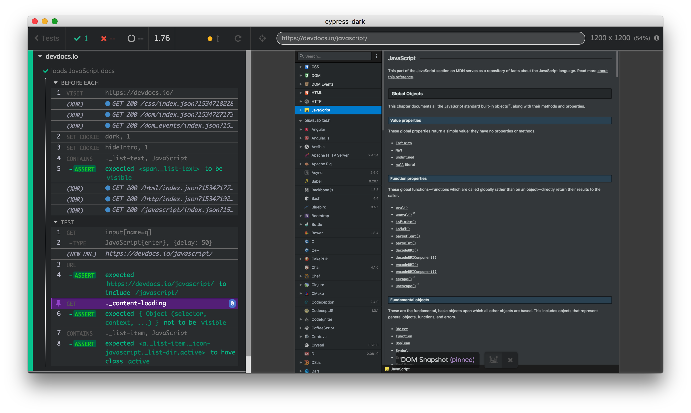

# cypress-dark-example

> Example showing a project that uses [cypress-dark](https://github.com/bahmutov/cypress-dark) theme

Read [Cypress Halloween Theme](https://www.cypress.io/blog/2018/10/11/halloween-theme/)

See [cypress/support/index.js](cypress/support/index.js), in general you just need to

1. `npm i -D cypress-dark`
2. Add `require('cypress-dark')` to your `cypress/support/index.js` file
